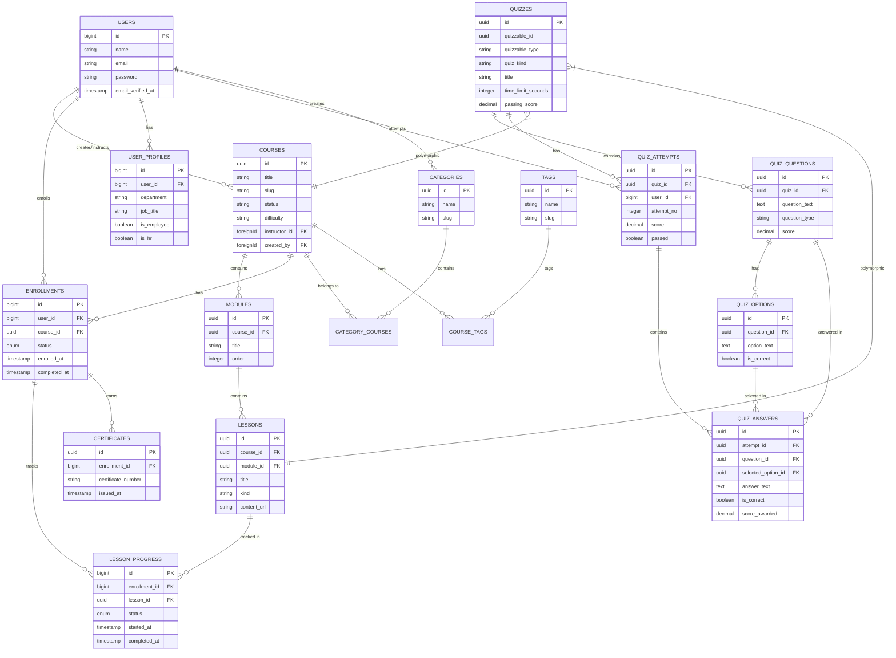

# Database ERD

```mermaid
erDiagram
    USERS ||--o{ COURSES : "creates/instructs"
    USERS ||--o{ ENROLLMENTS : "enrolls"
    USERS ||--o{ USER_PROFILES : "has"
    USERS ||--o{ QUIZ_ATTEMPTS : "attempts"
    USERS ||--o{ CATEGORIES : "creates"

    COURSES ||--o{ MODULES : "contains"
    COURSES ||--o{ ENROLLMENTS : "has"
    COURSES ||--o{ CATEGORY_COURSES : "belongs to"
    COURSES ||--o{ COURSE_TAGS : "has"

    MODULES ||--o{ LESSONS : "contains"

    LESSONS ||--o{ LESSON_PROGRESS : "tracked in"

    ENROLLMENTS ||--o{ LESSON_PROGRESS : "tracks"
    ENROLLMENTS ||--o{ CERTIFICATES : "earns"

    CATEGORIES ||--o{ CATEGORY_COURSES : "contains"
    TAGS ||--o{ COURSE_TAGS : "tags"

    QUIZZES ||--o{ QUIZ_QUESTIONS : "contains"
    QUIZZES ||--o{ QUIZ_ATTEMPTS : "has"
    QUIZZES }|--|| COURSES : "polymorphic"
    QUIZZES }|--|| LESSONS : "polymorphic"

    QUIZ_QUESTIONS ||--o{ QUIZ_OPTIONS : "has"
    QUIZ_QUESTIONS ||--o{ QUIZ_ANSWERS : "answered in"

    QUIZ_ATTEMPTS ||--o{ QUIZ_ANSWERS : "contains"

    QUIZ_OPTIONS ||--o{ QUIZ_ANSWERS : "selected in"

    USERS {
        bigint id PK
        string name
        string email
        string password
        timestamp email_verified_at
    }

    USER_PROFILES {
        bigint id PK
        bigint user_id FK
        string department
        string job_title
        boolean is_employee
        boolean is_hr
    }

    COURSES {
        uuid id PK
        string title
        string slug
        string status
        string difficulty
        foreignId instructor_id FK
        foreignId created_by FK
    }

    MODULES {
        uuid id PK
        uuid course_id FK
        string title
        integer order
    }

    LESSONS {
        uuid id PK
        uuid course_id FK
        uuid module_id FK
        string title
        string kind
        string content_url
    }

    ENROLLMENTS {
        bigint id PK
        bigint user_id FK
        uuid course_id FK
        enum status
        timestamp enrolled_at
        timestamp completed_at
    }

    LESSON_PROGRESS {
        bigint id PK
        bigint enrollment_id FK
        uuid lesson_id FK
        enum status
        timestamp started_at
        timestamp completed_at
    }

    CATEGORIES {
        uuid id PK
        string name
        string slug
    }

    TAGS {
        uuid id PK
        string name
        string slug
    }

    QUIZZES {
        uuid id PK
        uuid quizzable_id
        string quizzable_type
        string quiz_kind
        string title
        integer time_limit_seconds
        decimal passing_score
    }

    QUIZ_QUESTIONS {
        uuid id PK
        uuid quiz_id FK
        text question_text
        string question_type
        decimal score
    }

    QUIZ_OPTIONS {
        uuid id PK
        uuid question_id FK
        text option_text
        boolean is_correct
    }

    QUIZ_ATTEMPTS {
        uuid id PK
        uuid quiz_id FK
        bigint user_id FK
        integer attempt_no
        decimal score
        boolean passed
    }

    QUIZ_ANSWERS {
        uuid id PK
        uuid attempt_id FK
        uuid question_id FK
        uuid selected_option_id FK
        text answer_text
        boolean is_correct
        decimal score_awarded
    }

    CERTIFICATES {
        uuid id PK
        bigint enrollment_id FK
        string certificate_number
        timestamp issued_at
    }
```
